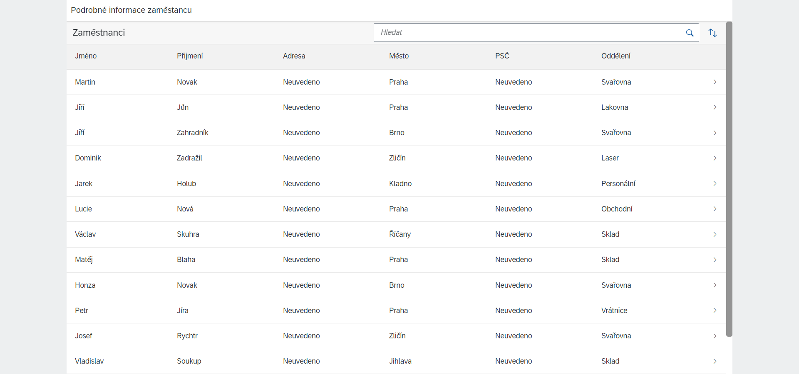

# Employee_Phonebook
A page with a simple overview of employees. Used openui5.

> 1. Employees data are random generated.
> 2. Used OPENUI5 Framework.
  >   - Simple solution for companies.
  >   - Compatible with SAP
> 3. Easy to expand.


## Main Page




## Employee Page


## Installation

Very easy to install.
Need to use XAMPP or other host apps.

```sh
open cmd
git clone https://github.com/S0nnyyy/Employee_Phonebook
```
